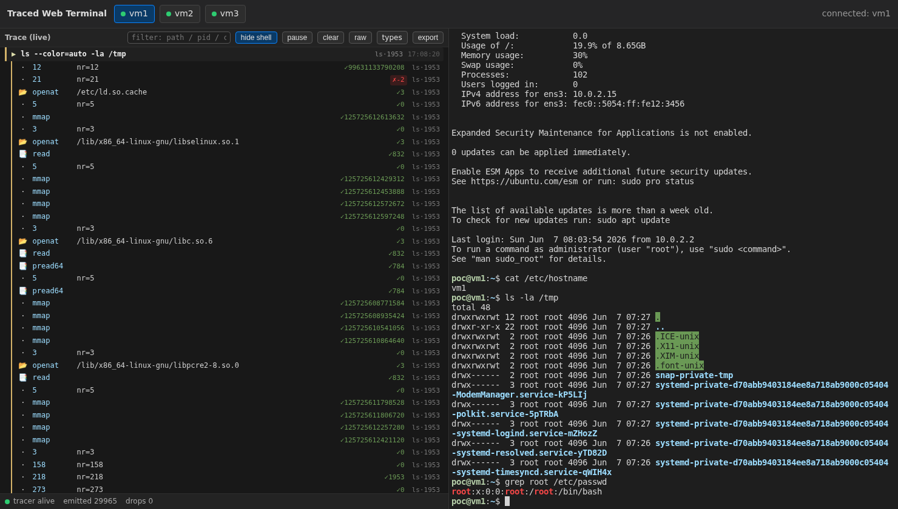

# Traced Web Terminal (PoC)



A superset of `poc/web-terminal`: the same browser → **BFF** → **Gateway (GW)** →
QEMU pipeline, plus a second, read-only **trace channel** that streams each
guest's kernel-level behavior — captured in-VM by the **bloodhound** eBPF tracer
— back to the browser and renders it live next to the terminal. Full design:
[DESIGN.md](DESIGN.md).

```
[ Browser ]  trace log (left) | xterm.js (right)
   │  /ws        terminal I/O (binary) + control (text)        ── bidirectional
   │  /ws/trace  raw BehaviorEvent NDJSON (text)               ── backend → browser
   ▼
[ BFF ] ──► [ GW + Runtime ] ──SSH──► [ vmN: sshd + bloodhound ]
```

## 1. What this verifies

That in-VM eBPF observation can be surfaced to the browser in real time, on the
same screen as interactive operation, without disturbing the terminal pipeline:

- A read-only `/ws/trace` channel, relayed 1:1 through the BFF, carries the live
  `BehaviorEvent` stream from a guest to a left-pane log.
- bloodhound runs resident in each guest, `auid`-scoped to the operator, and is
  tailed by the GW over a **separate watcher account** whose login uid differs
  from the operator's — so the reader is outside the `auid` filter and the
  observer feedback loop never starts (DESIGN §9).
- The trace path is purely additive: everything `web-terminal` validated keeps
  working, and a guest without bloodhound simply yields an empty trace pane.

Everything `web-terminal` verifies still applies; this README covers only the
trace additions.

## 2. Setup

Prerequisites are inherited from `web-terminal`: Go 1.25+, `qemu-system-x86_64` /
`qemu-img`, one of `cloud-localds` / `genisoimage` / `mkisofs` / `xorriso`, and
KVM access (`/dev/kvm`). A prebuilt bloodhound static binary must exist at
`bloodhound/target/docker/bloodhound` (build with `(cd bloodhound && make
build-docker)`), or point `BLOODHOUND_BIN` elsewhere. The build must include
runtime BTF offset resolution (abyss0-dev/bloodhound#37); an older build hardcodes
offsets to one kernel and silently drops every task-scoped event on any other
(DESIGN §10).

1. Run the test suite:

   ```
   go test ./...
   ```

2. Build the base image, overlays, and cloud-init seeds (bakes bloodhound and the
   watcher account into each guest). cloud-init runs once per fresh instance — if
   the overlays were already booted, delete them (`rm vm/overlay-vm*.qcow2`) before
   re-running so the new seed re-provisions:

   ```
   ./vm/fetch-image.sh
   ```

3. Start the Gateway (launches the three guests, serves `/targets`, `/attach`,
   `/trace`):

   ```
   go run ./cmd/gw -config config.json -addr :8081
   ```

4. Start the BFF in a second shell:

   ```
   go run ./cmd/bff -gw http://127.0.0.1:8081 -addr :8080 -web web
   ```

5. Open <http://127.0.0.1:8080>. Selecting a `ready` target opens both the
   terminal (right) and the trace channel (left).

Stop the GW with Ctrl-C; it terminates every guest it launched.

## 3. Reading the trace pane

The left pane renders the raw stream as a sequence of **command stories**, not a
flat log (DESIGN §7). An `execve` is shown as a prominent command anchor and the
events that follow are indented beneath it, each tinted by a stable per-`pid`
colour so one process's burst reads as a group:

```
▶ cat /etc/hostname              (cat·402) 12:03:01
│  📂 openat   /etc/hostname            ✓3
│  📑 read     24B                      ✓24
▶ ls -la /tmp                    (ls·405)  12:03:02
│  📂 openat   /etc/passwd          ✗-13   ls·405
```

- **Icons** by event: `📂` open · `📑` read · `✎` write · `✉` connect/packet ·
  `⌨` tty · `🛡` lsm · `▶` exec.
- **Return code badge**: `✓N` on success, `✗N` (red) on failure.
- Grouping is **best-effort and display-only** — it anchors on the most recent
  `execve` with the matching `pid`, not a real correlator; true command-unit /
  process-tree correlation is deferred (DESIGN §18).

**Controls** (toolbar), all display-only — the durable OPFS capture keeps every
line regardless (DESIGN §11, §13):

- **filter** — substring over path / pid / comm.
- **hide shell** (on by default) — drops shell housekeeping syscalls while keeping
  `execve`, so launched commands stay visible.
- **types ▾** — per-`event.type` toggles; **TTY is hidden by default** (keystroke
  echo, and it duplicates the right pane).
- **pause** (freeze the view, capture continues) · **clear** · **raw** (show the
  underlying NDJSON line) · **export** (download the captured `.ndjson`).

The status row at the bottom reflects HEARTBEAT: tracer-alive, cumulative emitted
count, and a drop counter (relay drops + tracer drops).

## 4. Configuration

The GW config extends `web-terminal`'s with a `trace` block (credentials stay
GW-only):

- `trace.enabled` — expose `/trace` for the runtime.
- `trace.logPath` — guest path bloodhound writes to (default
  `/var/log/bloodhound.ndjson`).
- `trace.operatorUid` — the uid bloodhound filters on; the single source of truth
  for the operator uid (provisioning pins the `poc` user to it and the daemon's
  `--uid` derives from it).
- `trace.watcher` — the account the trace tail logs in as. Its login uid must
  differ from `operatorUid`; provisioning creates `watcher` (uid 2000) in the
  `systemd-journal` group with no sudo.

## 5. Verification checklist

Each item maps to a DESIGN §16 success criterion. The terminal-side checks from
`web-terminal` §3 also still apply.

1. **bloodhound live, not blind (§16-1).** After a target is `ready`, the GW
   gates trace-readiness on the guest journal showing `Resolved task_struct
   offsets …`; opening the trace pane on a blind tracer is refused rather than
   showing a healthy-looking empty stream. Run `cat /etc/hostname` in the terminal
   and confirm matching `execve` / `openat` lines appear on the left.
2. **Channels independent (§16-2).** The trace pane works whether or not the
   terminal is attached; typing `exit` in the terminal does not stop the trace
   stream, and vice versa.
3. **Live observation (§16-3).** A command typed on the right produces
   corresponding lines on the left within about a second.
4. **Operator-scoped (§16-4).** Only the operator's own behavior appears;
   unrelated background activity does not (the `auid` filter, end-to-end).
5. **Per-target routing (§16-5).** `vm1`'s trace pane reflects `vm1`, not `vm3`.
6. **Backpressure without stall (§16-6).** `find /` does not freeze the UI; the
   ring buffer caps DOM growth and the drop counter advances if lines are shed.
7. **HEARTBEAT status (§16-7).** The status row shows the tracer alive with a
   rising emitted count.
8. **Durable capture (§16-8).** `export` downloads the captured `.ndjson`; its
   line count is consistent with what was emitted minus reported drops (exact
   reconciliation is out of scope — DESIGN §15).
9. **Credential confinement (§16-9).** No credentials appear on either WebSocket
   or in the BFF; the trace channel carries only event lines and meta.
10. **Graceful absence (§16-10).** With bloodhound stopped (`sudo systemctl stop
    bloodhound`), the trace pane is empty while the terminal stays functional.
11. **No observer feedback (§16-11).** Open the trace pane and leave the operator
    idle: the pane stays quiet (only heartbeats drive the status row), and the
    drop counter does not climb on its own. This confirms the trace tail runs
    outside bloodhound's `auid` filter.

## 6. Notes

- bloodhound is consumed as a built artifact and never modified; all changes live
  in this PoC and its provisioning (DESIGN §19).
- The trace pane deliberately exposes the raw observation surface — an instructor
  / debugging view, the inverse of the production posture where the in-VM
  observation surface is hidden from the learner (DESIGN §19).
- bloodhound's LSM tamper-resistance hooks need BPF LSM in the active stack, which
  stock Ubuntu does not enable; their attach is non-fatal and the syscall /
  tracepoint / TTY capture this PoC relies on is unaffected (DESIGN §10).
